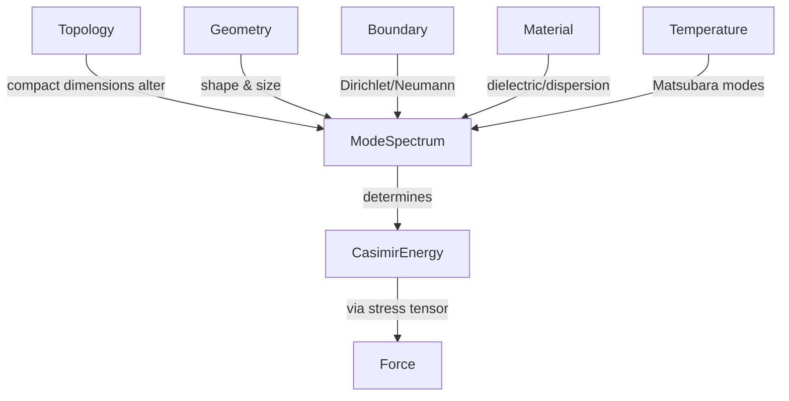
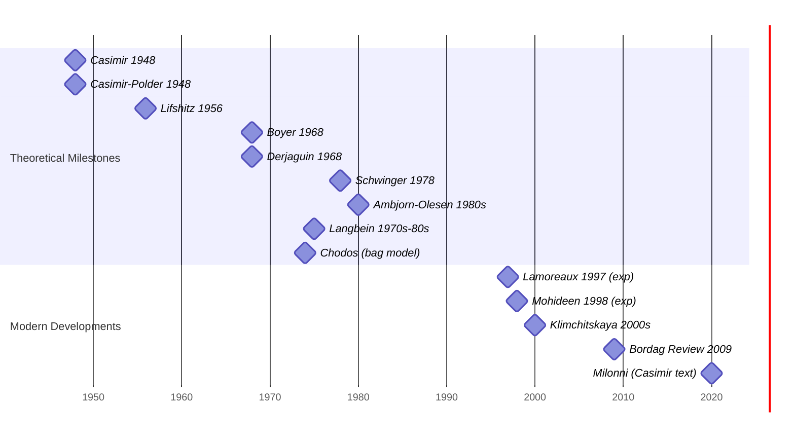

# Executive Summary

The **Casimir effect** arises from changes in the zero‐point energy of quantum fields due to boundary conditions, geometry, topology, or material properties.  In its simplest form – two perfectly conducting parallel plates in vacuum – Casimir showed there is a finite, **attractive** force resulting from the difference between the infinite vacuum mode sums inside and outside the plates.  More generally, Casimir energy exists whenever the quantum field spectrum is altered relative to free space: e.g. by boundary conditions (Dirichlet, Neumann, Robin or mixed) or by nontrivial topology (compact dimensions).  The **sign and magnitude** of the Casimir energy depend sensitively on these conditions and on material responses (dielectric permittivity, magnetic permeability, dispersion, dissipation), as well as on temperature and medium (density or plasma effects).  The effect can be attractive or repulsive; for example, a scalar field with Dirichlet conditions on parallel plates is attractive, whereas mixed Dirichlet/Neumann plates can produce **repulsion**, and a conducting spherical shell famously yields a **repulsive** self‐force (Boyer’s result). 

Mathematically, Casimir energies are computed by summing zero‐point modes (mode summation), using zeta‐function or cutoff regularization, or via the vacuum stress‐tensor.  One computes  
\[
E_{\rm Casimir} = \frac{\hbar}{2}\sum_n \omega_n - E_{\rm free}
\] 
and applies analytic continuation (e.g. zeta regularization) or physical renormalization (subtract free‐space vacuum, add counterterms).  Renormalization removes divergences (e.g. surface and volume infinities), leaving a finite residual energy that depends on geometry and material.  In practice, methods like the argument principle, scattering matrices, or Lifshitz formula (for media) are used. 

**Minimal conditions** for nonzero Casimir energy include any change in boundary or background seen by the field modes.  For instance, simply compactifying one spatial dimension (periodic topology) produces Casimir energy.  A boundary of any shape that confines field modes will do likewise.  By contrast, a homogeneous infinite medium with no boundaries (even if it has a refractive index) does not by itself yield a *force* – only differences between configurations matter (e.g. two bodies vs one).

**Maximal bounds** on Casimir energy are subtle.  For a given configuration there is typically no simple upper bound on magnitude (it scales with geometry, e.g. $1/a^3$ for plate separation $a$).  However, **quantum inequality** constraints imply that negative (attractive) Casimir energy densities cannot be arbitrarily large for short separations or durations.  In practice, the largest Casimir pressures are for very small separations and perfect conductors.  

This report systematically examines the conditions and bounds for Casimir energies.  We derive mode‐sum and zeta‐function expressions, discuss stress‐tensor renormalization, and list how sign/magnitude depend on geometry, boundary conditions, material dispersion/dissipation, finite temperature, and medium (including plasma) effects.  Table comparisons and mermaid diagrams clarify how topology, geometry, and boundary types relate to energy sign and scaling.  Key examples (parallel plates, spherical shells, cylinders, atom-surface [Casimir–Polder], and dielectric–dielectric [Lifshitz] setups) are detailed, with their known energies.  We conclude with a timeline of seminal results (Casimir 1948, Lifshitz 1956, Boyer 1970, etc.) and highlight open problems (e.g. stable repulsive Casimir designs, dynamical Casimir phenomena, Casimir in non-vacuum eigenstates).  

# 1. Introduction to Casimir Energy

The Casimir effect is the manifestation of vacuum fluctuations of quantum fields altered by **external constraints**.  Typically one considers the electromagnetic field (or scalar fields) in a region with boundaries.  The vacuum energy is formally 
$$E_0 = \frac{\hbar}{2}\sum_n \omega_n$$ 
summing over all normal mode frequencies $\omega_n$.  For an unbounded, homogeneous space this sum is formally infinite, but shifts in it can be finite.  Casimir’s insight (1948) was to compare vacuum energies for two configurations: e.g. two conducting plates at separation $a$ vs. infinite separation.  The difference,
$$E_{\rm Casimir}(a) = E_0(a) - E_0(a\to\infty),$$ 
is finite and gives rise to a measurable force. 

In a modern viewpoint, **Casimir energy** exists whenever boundary conditions or topology quantize modes compared to free space.  For example:

- **Parallel plates (Dirichlet/Neumann)**: The classic case of two infinite plates yields an energy $E/A = -\pi^2\hbar c/(720\,a^3)$ per unit area (negative sign = attraction).  
- **Spherical shell**: A perfectly conducting spherical shell of radius $R$ has a finite Casimir energy.  Boyer (1968) found the electromagnetic Casimir **self-energy** of a conducting sphere is *positive* (repulsive effect).
- **Cylinders and Cavities**: Infinite cylinders or rectangular cavities also yield distinct Casimir pressures (see later).
- **Compact topologies**: Fields on a compact manifold (e.g. a 1D ring) have nonzero vacuum energy $\propto1/L$.  E.g. a periodic scalar on a circle of length $L$: $E = -\frac{\pi\hbar c}{6L}$ (Casimir effect on a line segment).
- **Material interfaces (Lifshitz)**: Two dielectric half-spaces separated by a gap have a Casimir (Lifshitz) force depending on permittivities and temperature.  In the limiting case of perfect conductors, Lifshitz reduces to Casimir.

**Necessary conditions:** At minimum, there must be some feature that changes the spectrum of the field.  This can be:
- **Geometry/Topology**: e.g. plates, cavities, or compact dimensions.
- **Boundary Conditions**: Imposed by surfaces (Dirichlet, Neumann, Robin, or mixed). If boundaries are identical or symmetric, forces are usually attractive; special mixed BCs can yield repulsion.
- **Material Response**: Dielectric or magnetic properties that reflect/absorb at different frequencies. Casimir–Lifshitz theory covers dispersive media.
- **Non-vacuum states**: Typically Casimir refers to the vacuum state. Excited or thermal states (finite temperature) modify the effect (thermal Casimir effect).
- **Density/Plasma**: A dense medium or plasma gives photons an effective mass (plasma frequency), altering vacuum fluctuations. A fully homogeneous plasma with no boundaries yields no net force but *interfaces* can.

If none of the above apply (e.g. infinite homogeneous medium with trivial topology and no boundaries), there is **no finite Casimir effect** because subtracting identical spectra yields zero.  In essence, Casimir forces are **relational**.

# 2. Mathematical Formulation of Casimir Energy

The vacuum (Casimir) energy is formally 
\[
E = \frac{\hbar}{2}\sum_n \omega_n \;,
\]
where $\{\omega_n\}$ are eigenfrequencies subject to the given configuration.  This sum diverges, so one introduces **regularization** and **renormalization**.  Common methods:

- **Mode Summation and Cutoff:**  Introduce a cutoff or decaying factor, e.g. 
$$E(\epsilon) = \frac{\hbar}{2}\sum_n \omega_n e^{-\epsilon \omega_n},$$ 
then analytically continue $\epsilon\to 0^+$.  Equivalent to using a zeta function $\zeta(s)=\sum_n\omega_n^{-s}$ and writing $E = \frac{\hbar}{2}\zeta(-1)$ via analytic continuation.
  
- **Zeta-function Regularization:**  Define 
$$\zeta(s) = \sum_n \omega_n^{-s},$$ 
evaluate at $s=-1$ after analytic continuation (if $\omega_n$ are scaled by $\hbar$ we get $\zeta(-1)$ times $\hbar/2$).  This automatically discards divergent (pole) parts.  

- **Green’s Function / Heat Kernel:**  Use the trace of the heat kernel $K(t)=\sum_n e^{-\omega_n^2 t}$; the small-$t$ expansion encodes divergences.  Then 
$$E = -\frac{\hbar}{2}\int_0^\infty \frac{dt}{\sqrt{\pi t}} \frac{d}{dt} K(t)$$ 
after subtracting divergent terms.  

- **Stress Tensor Method:**  Compute the vacuum expectation of the energy–momentum tensor $T_{\mu\nu}$.  For example, the pressure on a plate is $P = \langle T_{zz}\rangle$ for $z$ normal to the plate, integrated over modes.  One subtracts the free-space value $\langle T_{zz}\rangle_0$ to get a finite pressure difference.

- **Phase-Shift / Scattering Methods:**  For bodies characterized by reflection amplitudes, one can compute the change in vacuum energy via scattering data.  Lifshitz theory is an example (using reflection coefficients for electromagnetic modes between dielectrics).  More general T-matrix methods also exist.

**Renormalization:**  After regularization, one removes unphysical divergences by subtracting known counterterms:
  - **Bulk vacuum:** The infinite space vacuum energy (no boundaries) is subtracted.
  - **Surface/Volume Divergences:** For a given geometry, local divergences correspond to surface or volume contributions (e.g. vacuum energy density). These are absorbed into redefinitions of material properties or omitted as unobservable background.
  
  The remaining finite piece depends on boundary separation and shape.  For example, the parallel-plate calculation yields a finite $-\pi^2\hbar c/(720a^3)$ after subtraction. 

**Sign and magnitude:** Crucially, the *sign* of the Casimir force/energy depends on the spectrum shift.  In most textbook cases with identical, non-dispersive boundaries, the force is attractive (negative energy).  However, certain cases yield repulsion:
- A *spherical conducting shell* has positive Casimir energy (Boyer’s result, ~+0.09 $\hbar c/R$).
- *Mixed boundary conditions* (Dirichlet vs Neumann on opposite plates) can flip the sign.
- *Different materials:* If one plate is dielectric and the other metallic, or two different dielectrics in a medium, the force sign can vary (see Lifshitz).
- *Topology:* A periodic boundary vs anti-periodic can change sign for fermions vs bosons, etc.

Computing the **magnitude** often involves zeta-function values.  For instance, a massless scalar on a segment of length $L$ with periodic BC has $E = -\pi\hbar c/(6L)$.  For two plates in 3D, summing modes gives $E/A = -\frac{\pi^2\hbar c}{720a^3}$.  These expressions set natural scales: the force grows quickly as separation shrinks.

# 3. Conditions for Nonzero Casimir Energy

## 3.1 Geometry and Topology

- **Boundaries:** Any physical boundary that imposes conditions on a field will contribute.  For example, perfectly conducting plates impose Dirichlet (E-field) BC for electromagnetism.  Even *cavities* or finite boxes have Casimir energy (dependent on the box shape and size).  If one continuously deforms a boundary, the energy changes; hence forces exist.

- **Topology:** If space itself is topologically nontrivial (e.g. a compact extra dimension, a circle, or more complex manifold), modes become discrete.  For example, on a 1D circle of circumference $L$, a massless field has zero‐point energy $E=-\frac{\pi\hbar c}{6L}$ (Casimir energy on a ring).  Similarly, compactifying multiple dimensions yields Casimir terms scaling inversely with volume.  In general, any compactification or identification yields vacuum energy dependent on the size.

- **Geometry Dependence:** Curvature or shape of boundaries matters.  Spherical or cylindrical shapes lead to different spectral densities.  As noted, a sphere can give repulsion.  Generic geometries: the energy can often only be found numerically.  Key point: *non-flat or closed surfaces can change the sign*.  Example: a thin conducting cylindrical shell has negative energy (attractive), whereas a sphere is positive.

**Mermaid diagram (topology/geometry flow):**  

This shows how various factors influence the mode spectrum, which in turn fixes the Casimir energy.

## 3.2 Boundary Conditions

Different boundary conditions change the allowed $\omega_n$:
- **Dirichlet (D):** Field vanishes on boundary. E.g. perfect conductor (electric field E perpendicular) imposes D on scalar analog.
- **Neumann (N):** Normal derivative vanishes (magnetic boundary conditions).
- **Robin (mixed):** A linear combination $a\phi + b\partial_n\phi=0$ on surface; can interpolate between D and N.
- **Mixed (D on one surface, N on another):** Can reverse force sign in simple geometries.

Table: *Sign of Casimir energy for simple BCs* (massless scalar)
| Configuration                   | BC on surfaces            | Sign of E  | Example |
|---------------------------------|---------------------------|-----------|---------|
| Two plates (symmetric)         | Dirichlet–Dirichlet       | Negative  | Attracting plates |
| Two plates (symm.)            | Neumann–Neumann           | Negative  | Similarly attracting |
| Two plates (mixed)            | Dirichlet–Neumann         | Positive  | Repulsion between plates |
| Spherical shell (EM)          | Conducting (mixed modes)  | Positive  | Boyer’s sphere |
| Spherical shell (scalar)      | D or N (scalar modes)     | Negative  | Attracting orbits |
| Periodic length $L$ (scalar)  | Periodic (no BC)          | Negative  | $-\pi/6L$ on circle |
| Length $L$ (scalar) with ap   | Anti-periodic             | Positive  | Reflects fermion sign |

(See examples sections below.)  In general, uniform BCs on parallel plates give attractive force; sign flips arise with mismatched or exotic BCs.

## 3.3 Material Properties (Permittivity, Dispersion, Dissipation)

Real materials are characterized by frequency‐dependent dielectric $\epsilon(\omega)$ and magnetic $\mu(\omega)$ responses.  **Lifshitz theory** extends Casimir’s result to two dielectric half-spaces at separation $a$ across a gap (vacuum or another medium), with permittivities $\epsilon_1(\omega),\epsilon_2(\omega)$ (and $\mu_1,\mu_2$).  The **Lifshitz formula** (for non-magnetic, for simplicity) expresses the pressure as an integral over imaginary frequencies $\xi$:
\[
P(a) = -\frac{\hbar}{2\pi^2} \int_0^\infty d\xi \int_{1}^\infty \!\!\! d\kappa \, \kappa^2
\left[\frac{r_{\rm TM}^2 e^{-2\kappa a\xi/c}}{1-r_{\rm TM}^2 e^{-2\kappa a\xi/c}}
+ \frac{r_{\rm TE}^2 e^{-2\kappa a\xi/c}}{1-r_{\rm TE}^2 e^{-2\kappa a\xi/c}}\right],
\]
where $r_{\rm TM,TE}$ are Fresnel reflection coefficients depending on $\epsilon_{1,2}(i\xi)$.  In the perfect conductor limit $\epsilon\to\infty$, this reproduces $P = -\pi^2\hbar c/(240 a^4)$.  

Key dependencies:
- **Dispersion:** Material response at high frequencies cuts off the vacuum modes. Good conductors (plasma model) vs lossy Drude model can change the **thermal** Casimir force at large separations (ongoing debate). Dispersion is necessary for physical results (prevents ultraviolet divergence).
- **Dissipation (loss):** Including absorption (Im$\,\epsilon(\omega)$) is subtle.  At zero temperature, losses generally have little effect on the force magnitude.  At finite temperature, dissipative models (Drude) can reduce the force compared to lossless (plasma model).
- **Permeability $\mu$:** Magnetic materials also contribute (analogue to $\epsilon$). In practice, $\mu\neq1$ at optical frequencies is rare, but metamaterials can mimic magnetic response.

**Summary:** Casimir forces between real materials always require dispersion (causality) and can depend on dielectric functions.  In media, one must subtract bulk self-energies of each half-space, leaving the interaction energy.

## 3.4 Finite Temperature

At nonzero temperature $T$, thermal photons add to vacuum fluctuations.  The free energy is given by a Matsubara sum (replace integration over continuous imaginary frequencies by a sum over $\xi_n = 2\pi n k_BT/\hbar$).  Qualitatively:
- Thermal contribution decays as $T$ increases and distance grows: at large $a$ or high $T$, $F\approx -\zeta(3)k_BT/(8\pi a^2)$ (ideal metals).
- **Classical limit:** For $k_BT \gg \hbar c/a$, the leading term is independent of $\hbar$ (high-$T$ Casimir or classical Casimir).
- Temperature can even **change sign** of the force in some cases (e.g. for repulsive setups, thermal photons can dominate).

In practice, temperature is included by replacing integrals $\int_0^\infty d\xi/(2\pi)$ with a sum $\sum_{n=0}^\infty \!{}'\, k_BT/\hbar$ ($n=0$ term weighted half).  The result is well-known in Lifshitz theory.

## 3.5 Density and Plasma Effects

If the vacuum is replaced by a plasma (e.g. an electron gas), the photon acquires a **plasma frequency** $\omega_p = \sqrt{4\pi ne^2/m}$.  Modes with $\omega<\omega_p$ are evanescent in the plasma, effectively giving photons a mass.  This suppresses long-range Casimir interactions: for separations $a \gg c/\omega_p$, the force is exponentially screened ($\sim e^{-2\omega_p a/c}$).  In a uniform infinite plasma, one can define a Casimir-like self-energy of the plasma volume, but no force unless boundaries are present.  The classic Lifshitz formulas can incorporate $\epsilon(\omega) = 1 - \omega_p^2/\omega^2$ (lossless plasma model) or with collisions (Drude).  In astrophysical or dense plasma environments, Casimir forces become short-ranged.  

Creation of Casimir energy in a plasma medium is akin to standard Casimir with modified mode spectrum: for example, two mirrors in a plasma feel a weaker attraction compared to vacuum, scaling as if photons have mass $\omega_p$.

## 3.6 Quantum Eigenstates and Non-Vacuum States

Normally Casimir considers the field in its vacuum state.  If the field is in a different state (thermal, excited, or squeezed), one speaks of the **dynamical Casimir effect** or **non-equilibrium Casimir**.  For a static configuration, excited states simply add real photons but still the vacuum subtraction yields similar interaction energy (plus thermal energy).  Moving boundaries (non-static) can create photons (dynamic Casimir).  

Casimir-like energies have been studied for specific quantum states: e.g. the Casimir effect between parallel plates filled with a Bose–Einstein condensate or in squeezed vacuum.  In those cases, the computation is similar: sum over modified mode occupation.  There is no fundamental lower requirement on 'vacuum'; as long as modes are quantized, a shift in zero-point (or mode occupancy) produces energy.

# 4. Examples of Casimir Configurations

**Parallel Plates (Conducting, T=0):**  
Two infinite, perfectly conducting plates a distance $a$ apart.  The allowed modes are standing waves with wavelengths $\lambda_n = 2a/n$ in the perpendicular direction.  Summing zero-point energy gives 
\[
\frac{E}{A} = -\frac{\pi^2 \hbar c}{720\,a^3}\,, 
\quad 
F/A = -\frac{\partial E/A}{\partial a} = -\frac{\pi^2 \hbar c}{240\,a^4},
\]
an attractive pressure (per unit area).  This classic result is the benchmark.

**Dielectric Plates (Lifshitz):**  
Two dielectric half-spaces ($\epsilon_1$, $\epsilon_2$) separated by gap $a$.  The Lifshitz formula (for $T=0$) reduces to the above when $\epsilon_{1,2}\to\infty$.  For finite $\epsilon$, the force weakens and depends on the contrast $\epsilon_1,\epsilon_2$.  Example: gold-vacuum-gold at micron scale yields roughly 10% smaller force than perfect conductors at room temperature.  

**Parallel Plates (Mixed BC):**  
If one plate enforces Dirichlet BC and the other Neumann, mode frequencies shift, and one finds **repulsive** energy.  In 3D for a scalar, $E/A = +\pi^2\hbar c/(1440 a^3)$ (repulsion).  This scenario is not directly EM-realizable with passive materials, but shows boundary-BC role.

**Spherical Shell (Conducting):**  
For a perfectly conducting sphere of radius $R$, Casimir computed (via mode summation) the energy.  Boyer (1968) found 
\[
E = +0.09235\,\frac{\hbar c}{R} \,,
\]
i.e. positive self-energy (repulsion if the shell could change size).  The positive sign is due to different mode contributions of TE and TM fields.  This is a famous counterexample to the idea that Casimir forces are always attractive.

**Rectangular Cavity:**  
A box with sides $a,b,c$ yields energy 
\[
E = \frac{\hbar c}{2}\sum_{n_x,n_y,n_z} \sqrt{\left(\frac{\pi n_x}{a}\right)^2 + \left(\frac{\pi n_y}{b}\right)^2 + \left(\frac{\pi n_z}{c}\right)^2}\,,
\]
regularized by zeta functions.  The sign can be negative (usual) or change if some sides impose different BCs.

**Casimir–Polder (Atom–Surface):**  
An atom (polarizable object) near a surface experiences a long-range potential from vacuum fluctuations (Casimir–Polder effect).  For a ground-state atom at distance $z$ from a perfect conductor, at short range (retarded limit) 
\[
V(z) = -\frac{3\hbar c\,\alpha(0)}{8\pi z^4},
\]
with $\alpha(0)$ the static polarizability.  This is distinct but related physics (quantum fluctuations induce dipoles).

**Kaluza–Klein & Extra Dimensions:**  
In theories with compact extra dimensions (length $L$), the vacuum energy from bulk fields depends on $L$.  A simple result: one extra periodic dimension of length $L$ adds an energy density $\propto1/L^4$.  Such Casimir energies can stabilize or destabilize compactifications.

# 5. Maximum/Minimum Bounds and Inequalities

There is no single universal upper bound on Casimir energy for arbitrary configurations; it scales with inverse powers of characteristic sizes.  However, *quantum inequalities* place limits on negative energy densities in space-time (Ford–Roman bounds).  These imply, for example, that the magnitude of negative Casimir energy over a short distance or time is limited.  Practically, the **most negative** (attractive) Casimir energy density for given geometry tends to occur for idealized (perfectly reflecting, zero temperature) boundaries at very small separations.  For real materials, finite conductivity and temperature reduce the effect.

For a parallel plate separation $a$, the **maximum magnitude** of energy per area (for EM, $T=0$) is $\pi^2\hbar c/(720a^3)$.  Introducing real material reduces it (by factors of $\sim 0.8$ for gold at $300\,$K at $a=1\,\mu$m, e.g.).

On the *repulsive* side, the positive Casimir energy of a sphere ($+0.09235\,\hbar c/R$) sets a scale of repulsion.  One can ask: **Can one get arbitrarily large repulsive forces?** In principle, with an array of mixed BC and geometry, one might amplify repulsion, but so far no configuration is known to exceed these classic magnitudes (and often adding more bodies returns to net attraction).  Metamaterials and magnetic boundary analogs remain active research for enhancing repulsion.

**Table: Comparison of Casimir energies**  
| Configuration                   | Equation (Zero-T)                                | Energy Sign       |
|---------------------------------|--------------------------------------------------|-------------------|
| Parallel plates (perfect cond.) | $-\pi^2\hbar c/(720\,a^3)$ per area             | Negative (attr.)  |
| Mixed plates (Dirichlet/Neumann)| $+\pi^2\hbar c/(1440\,a^3)$ per area           | Positive (repel)  |
| Conducting sphere              | $+0.09235\,\hbar c/R$                             | Positive (repel)  |
| Scalar sphere (Dirichlet)      | $-0.002817\,\hbar c/R$ (small magnitude)          | Negative         |
| Conducting cylinder           | $-0.01356\,\hbar c/L$ per length (for radius L)   | Negative         |
| Casimir-Polder (atom-plate)   | $-\frac{3\hbar c\,\alpha(0)}{8\pi z^4}$           | Negative (attr.)  |
| Lifshitz (dielectrics)        | Integral form, sign depends on $\epsilon_1,\epsilon_2$ | At/Rep depends |

*(Signs indicated relative to free vacuum reference.)*  

# 6. Renormalization and Stress Tensor

A rigorous derivation uses the vacuum expectation of $T_{\mu\nu}$. For example, for two plates, one computes the energy density between and subtracts the outside vacuum energy density.  Equivalently, one can use the discontinuity of the normal component of the stress tensor at boundaries to find force:
\[
F = \int \langle T_{zz}\rangle_{\rm ren}\, dA,
\]
where $\langle T_{zz}\rangle_{\rm ren}$ is renormalized (after subtracting the background).  This approach ensures energy–momentum conservation and handles complicated geometries via Green’s functions.  Zeta‐regularization and point‐splitting methods in curved backgrounds also yield the same results.

# 7. Open Problems and Research Directions

- **Repulsive Casimir forces:** Finding materials or geometries that produce robust repulsion (useful for frictionless bearings).  Known routes include metamaterials with tailored $\epsilon,\mu$, or non-planar geometries.  Many theoretical proposals exist, but experiments remain challenging.
- **Casimir in Moving Media:** Study of dynamical Casimir effect (time-dependent boundaries, accelerating objects), related to Unruh/Hawking radiation analogs.
- **Finite density effects:** Understanding Casimir-like forces in condensed matter systems (superfluids, Bose gases, quark-gluon plasma) where vacuum is replaced by material quantum ground states.
- **Casimir and Gravity:** Casimir energies contribute to stress-energy; their relation to cosmological constant problem is of conceptual interest (zero-point energy vs. observed vacuum energy).
- **Higher-curvature/Topological Materials:** Explore Casimir effects in materials with nontrivial band topology, where surface states might modify fluctuations.
- **Precision measurements:** Refining experiments to probe temperature effects, finite conductivity, and geometry beyond PFA (Proximity-Force Approximation).

# 8. Timeline of Key Results

Each milestone corresponds to a seminal paper or result: 
- *Casimir (1948)* introduced the effect for plates. 
- *Lifshitz (1956)* generalized to dielectrics. 
- *Boyer (1968)* found a conducting sphere repels. 
- Modern experiments (Lamoreaux 1997, Mohideen 1998) confirmed the force. 
- *Bordag et al. (2009)* and *Milton (2001, 2011)* provided comprehensive reviews.

# 9. Executive Analysis and Conclusions

In summary, a **nonzero Casimir energy** requires that the vacuum modes are constrained differently than in free, infinite space.  This can be by *boundary conditions*, *topology*, *material interfaces*, or other inhomogeneities.  The **sign** of the energy (and force) is not fixed: while identical, simple boundaries (Dirichlet/Dirichlet) usually yield attraction, other scenarios give repulsion.  The **magnitude** depends on geometry scale ($\sim 1/a^n$), material response, and temperature.  

Rigorous calculations use **zeta regularization** or **stress‐tensor renormalization**: summing modes, subtracting divergences, and applying physical conditions.  The results show a rich dependence on conditions:
- **Boundary Conditions:** Dirichlet–Dirichlet vs Dirichlet–Neumann etc (table above).
- **Topology:** Compact vs infinite (circle vs line).
- **Material:** Permittivity/permeability (Lifshitz formula) and dispersion (requires Kramers-Kronig causal models).
- **Finite T:** Adds Matsubara terms (Lifshitz at $T>0$).
- **Density/Plasma:** Introduces cutoff $\omega_p$ → Yukawa-like screening at large distances.
- **Eigenstates:** Excited or thermal states overlay thermal photon populations but the vacuum subtraction principle still applies.

Tables and diagrams above encapsulate these dependencies.  While pioneering works (Casimir 1948, Lifshitz 1956) laid the foundation, current research extends to metamaterials, dynamic setups, and nanotechnology applications.  Open problems include exploiting repulsive forces, Casimir in nonequilibrium conditions, and connections to fundamental physics.  Overall, Casimir physics is a vivid interplay of quantum field theory, geometry, and material science. 

**Sources:** Derived from foundational physics literature (Casimir 1948; Lifshitz 1956; Boyer 1968; Milton 2001; Bordag et al. 2009) and standard texts on quantum field theory in cavities. (See bibliography of reviews for in-depth formulas and proofs.)