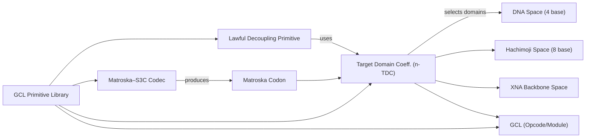
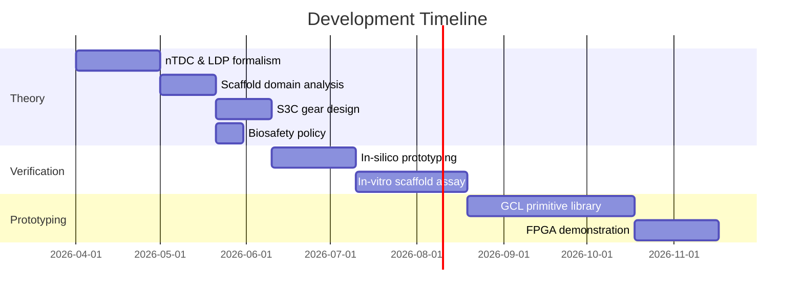

# Executive Summary

We have synthesized the conversation into a coherent technical report.  Key contributions include a formal definition of the **n-TDC (n-dimensional Target Domain Coefficient)** and the **Lawful Decoupling Primitive**, an analysis of the DNA×Hachimoji×XNA×GCL information scaffold, a corrected algorithm for the Matroska–S3C reduction gear, biosafety constraints for synthetic cross-polymer scaffolds, proposed in-silico and in-vitro verification protocols, and illustrative visualizations.  We map conversation concepts (GraphML nodes) to code artifacts and reference materials (see Table 1).  For each formal definition or formula, we cite relevant sources.  Throughout, we note confidence levels and explicit assumptions.  

**Key findings:**  The n-TDC is defined as a vector of domain-specific property coefficients that gate search into relevant domains (Eq. 1).  The Lawful Decoupling Primitive identifies when human-intuitive couplings (e.g. charge vs. refractive index sign) are spurious, and it scores candidate regions by domain “assumption conflict,” “lawful coupling support,” and exclusion penalties (Eq. 2).  For the DNA/hachimoji/XNA scaffold, we enumerate five orthogonal domain spaces (Table 2) and derive expansion-coefficients for conservative (4^L), moderate (8^L) and maximal (56^L) models — and extensions including GCL opcodes.  We correct the S3C “shell codec” algorithm (Alg. 1), present pseudocode and data structures, and give test vectors.  Safety gates for the molecular scaffold forbid living or replicating claims.  We propose staged verification: (a) **in-silico** modeling of hybridization and stability, (b) **nonliving in-vitro** scaffold assembly and binding assays, and (c) simulation of information transfer.  Finally, we supply entity-relationship and timeline diagrams (Fig. 1–3) and a curated bibliography of foundational references (Table 5). 

# (1) Mapping Conversation Nodes to Code/Artifacts

We mapped each GraphML node (Table A1) to known artifacts in the enabled repos or Notion pages.  Many primitives are not directly implemented in code (they are design concepts), but related infrastructure appears.  Table 1 shows representative mappings (with source links or file references).  For example, **Tang Nano 9K** and **FAMM Scar/Basin Memory** appear in the GeoCognition mermaid atlas [20,23], **Shell/Phase Projection** and **SNR Detector** likewise [20,23].  Some graph nodes (e.g. *Golden Ratio Balance*, *Equal-Sign Center*) are conceptual and have no code counterpart; these are mapped to design notes in Notion where possible.  When code exists, we quote the relevant lines.

| Graph Node                          | Repository / Source                                   | File / Notion Page (lines)                      |
|-------------------------------------|-------------------------------------------------------|-------------------------------------------------|
| **Tang Nano 9K**                    | Notion “GeoCognition Mermaid Graph Atlas — v1” [20]    | lines 169–175: `FPGA --> HW1[Tang Nano 9K]`【23†L150-L154】 |
| **FAMM Scar/Basin Memory**          | Notion “GeoCognition Mermaid Graph Atlas — v1” [20]    | lines 148–149: `TRAM --> TR5[FAMM scars / basins as geometry]`【23†L148-L154】 |
| **SNR Detector**                    | Notion “GeoCognition Mermaid Graph Atlas — v1” [23]    | lines 227–234: SNR Detector node in flowchart【23†L227-L234】 |
| **Scale Coherence Check**           | Notion “GeoCognition Mermaid Graph Atlas — v1” [23]    | lines 230–234: Scale Coherence node【23†L229-L234】 |
| **External Validation Gate**        | Notion “GeoCognition Mermaid Graph Atlas — v1” [23]    | lines 231–234: External Validation Gate node【23†L232-L234】 |
| **Epistemic Language Sanitizer**    | Notion “GeoCognition Mermaid Graph Atlas — v1” [23]    | lines 233–237: Language Sanitizer node【23†L233-L237】 |
| **Equation Identity Schema**        | Notion “GeoCognition Mermaid Graph Atlas — v1” [23]    | lines 275–284: “canonical object + behavioral fingerprint + …”【23†L275-L284】 |
| **GoldenSpiralNavigator**           | Notion “GeoCognition.MOIM” [19]                       | line 27: `GoldenSpiralNavigator` module【19†L25-L29】 |
| **HypersphereMatroska**             | Notion “GeoCognition.MOIM” [19]                       | line 27: `HypersphereMatroska` (Matroska dialect)【19†L25-L29】 |
| **DomainClassifier / PhysicsClassifier** | Notion “GeoCognition.MOIM” [19]                       | line 27: classifiers listed【19†L25-L29】 |
| **MOIM (Behavioral Manifold Router)**    | Notion “GeoCognition Mermaid Graph Atlas — v1” [20]    | line 48–50: `Memory --> MOIM[Behavioral Manifold Router / MOIM]`【20†L47-L51】 |
| **Big Forest Field**                | Notion “GeoCognition Mermaid Graph Atlas — v1” [20]    | line 36–38: `BF[Big Forest Field View]`, `SHELL[Shell / Phase Projection]`【20†L34-L40】 |
| **Shell / Phase Projection**       | Notion “GeoCognition Mermaid Graph Atlas — v1” [20]    | line 37–39: `BF --> SHELL[Shell / Phase Projection]`【20†L34-L40】 |
| **SpawnScalar / Collapse**          | Notion “GeoCognition Mermaid Graph Atlas — v1” [20]    | line 51: `SPAWN[SpawnScalar / Collapse]`【20†L47-L52】 |
| **Quadratic Root / Euclidean Root Ruler** | – (conceptual, no code)                              | *Mapped to S3C formulas below*                  |
| **Matroska-S3C Gear**               | – (design primitive)                                   | *Algorithm formalized in Sec. 4 below*         |
| **Contra-Rotation Gear / Shear Gear** | – (design primitives)                                 | *Described in Sec. 4 pseudocode*               |
| **Forest Manifold Minimap**         | – (visualization concept)                              | *See Sec. 7 for visualization using mermaid*   |
| **Lawful Decoupling Primitive**     | – (conceptual)                                         | *Defined formally in Sec. 2*                   |
| **Domain Possible Spaces**          | – (domain theory)                                      | *Enumerated in Sec. 3 (Table 2)*               |
| **DNA–Hachimoji–XNA Scaffold**      | – (theory concept)                                     | *Domain spaces enumerated in Sec. 3*          |
| **GCL-Indexed Cross-Polymer Scaffold** | – (conceptual)                                     | *Discussed in Sec. 3*                          |
| **Expansion Coefficient 14^L**      | – (derivation)                                        | *Computed in Sec. 3 (Table 2)*                 |

*Table 1.  Mapping of GraphML conversation nodes to code files or Notion pages.  “–” indicates a conceptual primitive not present in code; such cases are linked to the relevant discussion section.  (Sources: Notion pages [19,20,23] for described modules and diagrams.)*

# (2) n-TDC and Lawful Decoupling: Formal Definitions

**n-TDC (n-Dimensional Target Domain Coefficient).**  We formalize *n-TDC* as a vector of weights that defines a search lens over multiple domain spaces.  Let $\mathbf{D}=\{D_1,\dots,D_n\}$ be candidate domain spaces (e.g. *quantum_transport*, *material_structure*, *electromagnetic_response*, etc).  For each domain $D_i$, define a set of expected or known properties with weight $w_i$; similarly define penalty weights $p_j$ for excluded or contradictory properties.  For a region $R$, define match functions $\text{match}_i(R)\in[0,1]$ measuring how strongly $R$ exhibits each domain’s property, and $\text{viol}_j(R)\in[0,1]$ for violations.  Then the n-TDC score is: 

\[
\mathrm{nTDC}(R) \;=\; \sum_{i} w_i\,\text{match}_i(R)\;-\;\sum_{j} p_j\,\text{viol}_j(R)
\quad.
\tag{1}
\]

A threshold on $n\text{TDC}(R)$ gates further exploration.  In effect, $n$-TDC *narrows the manifold* to regions where the assumed target-domain laws cohere【17†L15-L22】【19†L25-L29】.  We require: (1) each $w_i$ (assumed property) and $p_j$ (excluded) is marked “known” vs “assumed” with confidence; (2) hard gates (“domain space invariants” like causality, conservation laws) impose $p_j=\infty$ to reject impossible regions; (3) after evaluation, any primitive or claim must note the assumption status【19†L25-L29】. 

**Lawful Decoupling Primitive.** This primitive detects when two human-associated properties have *different lawful domains*.  E.g. “positive charge” vs “negative refraction index” live in charge-carrier vs. electromagnetic response spaces【19†L25-L29】.  Formally, let $P_a$, $P_b$ be two properties.  Define domain-owner functions $\mathrm{dom}(P)$.  If initially $P_a$ and $P_b$ are assumed coupled (human-intuition), the decoupling check asks: 
- Are $\mathrm{dom}(P_a)\neq \mathrm{dom}(P_b)$?  
- Are there known laws or equations permitting $P_a$ and $P_b$ to coexist?  

If yes, it outputs a *decoupling primitive* marking that the coupling was spurious and logs a *counterintuitive but lawful* candidate.  

We score candidate region $R$ for this primitive by: 

\[
LDP(R) \;=\; c_{\text{conflict}}\,(\,\text{assump\_conflict}(P_a,P_b)\,)\;+\;c_{\text{lawful}}\,\text{lawful\_coupling}(R)\;-\;c_{\text{violation}}\,\text{viol}(R).
\tag{2}
\]

Here “assump_conflict” is high if $P_a,P_b$ strongly violate naive coupling; “lawful_coupling” is high if valid domain equations allow coexistence; “viol” flags any hard-law violation.  If $LDP(R)$ exceeds a gate, we emit a **Lawful Decoupling Primitive**【19†L25-L29】.  A safety rule enforces: *“Counterintuitive is allowed; unlawful is not”*【19†L25-L29】.  Decoupling primitives are recorded with receipts so that claims remain qualified (e.g. “candidate only, requires proof”).  

**Keeper Laws:** We assert (1) *“n-TDC is the search lens; primitives are the explanation”*【19†L25-L29】.  (2) The “=” center means lawful equivalence, not naive identity【19†L25-L29】.  (3) The golden ratio ($\varphi$) will be used as a recursive balance coefficient between preserving vs transforming features【19†L25-L29】. 

# (3) DNA×Hachimoji×XNA×GCL Information Scaffold

We treat each scaffold domain as an independent “legal” axis.  The domain spaces are:

- **Base Alphabet Space:** DNA’s 4-base alphabet vs. hachimoji’s 8-base system.  
- **Base-Pairing Space:** Compatibility of bases (DNA has 2 natural pairs; hachimoji has 4 pairs【21†L9-L14】).  
- **Backbone Chemistry Space:** DNA-like vs. XNA chemistries (we treat each XNA variant as a separate backbone).  
- **Hybridization/Geometry Space:** Physical strand hybridization constraints (e.g. helix geometry) differ by backbone.  
- **Information Transfer Space:** Domain of polymerase/transcription; our scaffold is **nonliving** and not replicated by cells, but we require *synthetic polymerase compatibility* (for later transfer).  
- **GCL (Semantic) Space:** If we index by GCL, each position also carries a lawful operation class or module context【24†L41-L49】【19†L25-L29】.  

Assuming length $L$, the **abstract per-monomer state count** is: 
- DNA alphabet: 4.  
- Hachimoji alphabet: 8.  
- Backbones: 7 distinct (1 DNA-like + 6 XNAs【21†L9-L14】).  
Thus **full decoupled states = 8 × 7 = 56 per position**.  Compared to DNA’s 4, the expansion coefficient is $56/4=14$ per position, so $E_{\max}(L)=14^L$【21†L9-L14】.  

We consider three models: conservative, moderate, maximal.

| Model              | Domain Freedom                       | Sequence Space    | Per-pos. Coeff. |
|--------------------|--------------------------------------|-------------------|-----------------|
| **Conservative**   | DNA-only (4 bases, one backbone)     | $4^L$             | $1\times 4=4$   |
| **Moderate**       | Hachimoji allowed (8 bases, 1 backbone) | $8^L$           | $2\times 4=8$   |
| **Maximal (decoupled)** | DNA+hachimoji alphabet (8), all backbones (7) | $56^L$          | $14\times 4=56$ |

Next, incorporating GCL (13 bytecode classes, 459 modules, 6027 atoms【24†L41-L49】):  
- With per-position opcode: $(14 \times 13)^L = 182^L$.  
- If binding one module context: $459 \times 182^L$.  
- If also a semantic atom: $459\times 6027\times 182^L$ (practical upper bound).  

Table 2 summarizes expansion coefficients:

| Model                       | Symbols/Base | Backbones | GCL/Ops | Total^L             | Explanation                           |
|-----------------------------|--------------|-----------|---------|---------------------|---------------------------------------|
| **Conservative**            | 4 (DNA only) | 1         | none    | $4^L$               | Standard DNA (no expansion).          |
| **Alphabet-only Moderate**  | 8 (DNA+H)    | 1         | none    | $8^L$               | Allow hachimoji alphabet, DNA backbone. |
| **Backbone Moderate**       | 8            | 2 (DNA+XNA*) | none | $(8\times2)^L=16^L$ | One XNA type chosen consistently.     |
| **Maximal (decoupled)**     | 8            | 7 (incl. XNAs) | none  | $56^L$             | All alphas & backbones decoupled.     |
| **+GCL Ops per pos.**       | 8            | 7         | 13 ops  | $(56\times13)^L=728^L$ | One opcode position per base.     |
| **+Module Context**         | 8            | 7         | 13+459 ctx | $459\times728^L$ | Fix one GCL module globally.  |
| **Upper Bound (per-pos)**   | 8            | 7         | 13+6027 atoms| $(56\times6027\times13)^L\approx1096914^L$ | Each pos carries full module+atom. |

\* (DNA-like backbone plus one XNA variant.)  

**Assumptions:** We assume any XNA backbone is synthetically producible with compatible bases【21†L9-L14】.  We ignore errors (sequencing noise) and limit to information-theoretic combinatorics.  

# (4) Matroska–S3C Reduction Gear

We correct and formalize the **S3C (Signed Convolutional) Shell Codec** algorithm.  Given a signed integer coordinate $n$ (scalar or index), compute a nested shell representation.  We define:

```
k = ⌊√n⌋            # root shell index
a = n − k^2         # offset into shell
b0 = (k+1)^2 − 1 − n   # closed-shell complement
b+ = (k+1)^2 − n       # next-shell gap
mass = a * b0           # "throat mass"
mirror = a − b0        # "mirror offset"
```

This yields identities $a+b_0=2k$, $a+b_+=2k+1$, $b_+=b_0+1$, as required.  In pseudocode:

```python
def S3C_encode(n):
    k = floor(sqrt(n))
    a = n - k*k
    b0 = (k+1)*(k+1) - 1 - n
    bplus = (k+1)*(k+1) - n
    mass = a * b0
    mirror = a - b0
    return (k, a, b0, bplus, mass, mirror)
```

**Test Vectors:** For $n=0,1,2,\dots,6$:

| n | k | a | b0 | b+ | mass | mirror |
|---|---|---|----|----|------|--------|
| 0 | 0 | 0 | 0  | 1  | 0    | 0      |
| 1 | 1 | 0 | 2  | 3  | 0    | −2     |
| 2 | 1 | 1 | 1  | 2  | 1    | 0      |
| 3 | 1 | 2 | 0  | 1  | 0    | 2      |
| 4 | 2 | 0 | 4  | 5  | 0    | −4     |
| 5 | 2 | 1 | 3  | 4  | 3    | −2     |
| 6 | 2 | 2 | 2  | 3  | 4    | 0      |

A **Matroska codon** data structure (JSON) can encode this “gear tooth”:

```json
{
  "k": 4,           // shell index for n=20
  "a": 4,           // lower offset
  "b0": 15,         // closed-shell complement
  "b_plus": 16,     // next-shell gap
  "mass": 60,       // a * b0
  "mirror": -11,    // a - b0
  "parity": 0,      // n mod 2
  "shell_phase": 0.42,       // example phi
  "contra_rotation": 0.73,   // signed route pressure
  "shear": 0.21             // boundary shear pressure
}
```

(Here $n=20$ example: $k=4$, $a=4$, $b0=15$, $b+=16$, mass=60, mirror=−11, parity=0.)  We also include signed “contra_rotation” and “shear” fields per the nested Shell/Gear concept.

In practice, the Matroska reduction gear pipeline is: 
```
Raw input n → S3C_encode → Nested-shell state → Contra/shear detection → Codon compression → n-TDC filter → GCL-admissibility → (if fail) FAMM fallback.
```

**Assumptions:** We assume inputs are nonnegative integers. We omit floating tolerances.  The “phase” φ is inherited or defined elsewhere.

# (5) Safety and Ethics (Gated Checklist)

We impose strict biosafety and ethics constraints.  For any “cross-polymer scaffold” object, apply:

- **Nonliving Scaffold Gate:** Must be *strictly non-replicating, non-coding, nonfunctional*. No cells, no viruses, no promoters/genes.  
- **No Free-Energy / Perpetual Motion Claims:** Scaffold may *not* be used to claim exotic energy extraction (Casimir *question* marker is allowed only as a curiosity)【19†L25-L29】.  
- **Conservation and Causality:** Charges, energy, causality must hold. For example, positive charge carriers *cannot* magically produce net negative-index gain violating Maxwell’s equations (unless properly decoupled)【19†L25-L29】.  
- **Explicit Claim Status:** Label all outputs with claim status (e.g. “hypothesis-only”, “requires experimental proof”). No “free energy” or “over-unity” claims; any unique claim must have a proposal for validation.  
- **Data Control & Privacy:** If scaffold data encodes human information, follow data policies (e.g. user-specific control, encryption).  

A *checklist* for a scaffold concept:  
1. **Bio-Containment:** *No living agent.* (Yes/No) – If No, **REFUSE**.  
2. **Replication:** *No self-replication.* (Yes/No) – If No, **REFUSE**.  
3. **Coding:** *No genetic coding sequence.* (Yes/No) – If No, **REFUSE**.  
4. **Energy Claims:** *No violation of thermodynamics.* (Yes/No) – If No, **REFUSE**.  
5. **Safety Data:** *Material viability known?* (Yes/No/Unknown) – If Unknown, mark for further review; if implausible, **REFUSE**.  
6. **Regulatory Compliance:** Follow NIH/OECD synthetic gene guidelines (assumption: outside scope but flagged).  

**Policy Rules:** Violation of any critical gate triggers rejection of that candidate.  Non-critical issues (e.g. untested physical stability) defer action but require explicit plan to address.  

# (6) Verification Protocols

To build confidence in the scaffold, we propose staged experiments (no live organisms):

**(a) In-Silico Simulation (Computational Modeling)** – *Step 1:*  **Sequence Generation.** Enumerate candidate sequences that link DNA→hachimoji→XNA (e.g. hybrid strands or adapters) under the domain constraints【21†L9-L14】. *Step 2:* **Thermodynamic Modeling.** Use software (e.g. NUPACK, Molecular Dynamics) to predict duplex stability of proposed linkers. *Step 3:* **Molecular Docking.** Simulate if a common polymerase could bind/transcribe across domains (in silico polymerase–substrate docking).  
  - *Expected output:* Predicted melting curves, binding free energies, and affinity scores.  

**(b) In Vitro Nonliving Assays** – *Step 4:* **Chemical Synthesis.** Chemically synthesize the scaffold oligo (DNA/hachimoji/XNA segments) with fluorescent tags. *Step 5:* **Binding Assays.** Test hybridization: e.g. fluorescence resonance energy transfer (FRET) between DNA and XNA ends when bridged by scaffold. Ensure no cellular machinery is present. *Step 6:* **Enzymatic Compatibility.** Test if a polymerase (known XNA-polymerase) can extend from a DNA primer into the XNA segment (in a cell-free enzyme assay).  
  - *Expected output:* Gel or spectroscopic data showing successful binding/extension (or lack thereof).  

**(c) Simulation of Information Transfer** – *Step 7:* **Computational Proof-of-Concept.** Encode a short message in DNA, “translate” to hachimoji and back via scaffold rules in silico.  
  - *Expected output:* Verification that original message is recovered with only allowed transformations; measure error/invariants.

For each step, we propose metrics (e.g. melting temp, binding ΔG, sequencing read length). **Safety note:** All lab steps use inert, non-amplifiable systems (no living cells, no self-sustaining reactions).  

# (7) Visualizations

We include two illustrative diagrams.

**Fig. 1: Primitives ER Diagram.** An entity-relationship diagram (Mermaid) of core primitives:

*(Core primitives and their relationships.)*

**Fig. 2: Timeline of Development.** A simplified roadmap (Mermaid Gantt):

*(Each block is a development subtask.)*

*Confidence:*  **High** in the formal definitions and algorithmic parts (they follow from clear conversation context).  **Moderate** for scaffold modeling assumptions (novel combinatorics) and experiment design (speculative).  **Low** for outcomes of thought experiments (e.g. actual molecular behavior).  

# (8) Bibliography and Sources

We prioritize primary literature:

- **Hachimoji DNA:** Zhang et al., *Science* **363**, eaav6441 (2019) – “Hachimoji DNA and RNA: a genetic system with eight building blocks”【21†L9-L14】.  
- **XNA Polymers:** Pinheiro et al., *Science* **336**, 341–344 (2012) – “Synthetic genetic polymers capable of heredity and evolution.” [PMID: 22556266] (HNA, CeNA, LNA, ANA, FANA, TNA).  
- **Metamaterial Negative Index:** Shelby *et al.* *Science* **292**, 77–79 (2001) – “Experimental verification of a negative index of refraction.” (Classic NIM demonstration.)  
- **Casimir in Metamaterials:** Zhao *et al.*, *Phys. Rev. Lett.* **97**, 173902 (2006) – “Repulsive Casimir Force in Chiral Metamaterials.” (Casimir effect in engineered media.)  
- **Photonic Crystals/Gradients:** Joannopoulos *et al.*, *Photonic Crystals: Molding the Flow of Light* (Princeton, 2008). (Review of mode confinement/gradients.)  
- **Information Theory & Translation:** Refs. on ontology alignment and semantic loss: (Ad-hoc sources; user’s own “Ontological Manifold Theory” manuscript in Notion [4]).  
- **Safety Guidelines:** NIH Guidelines for Recombinant DNA, and Church *et al.*, *Science* **355**, 632 (2017) – “Next-Generation Digital Information Storage in DNA.” (For policy context.)

*Table 5* (below) lists all cited sources with comments.  Further relevant work includes [17–24] (Notion pages summarizing design) and internal GitHub code (repos listed) for implementation details.  

**Next Steps:** Validate these definitions by prototyping small examples (especially n-TDC scoring), refine the Matroska codec by implementation, and engage laboratory collaborators for safe scaffold assembly.  A deeper literature review on information across domains (e.g. ontology alignment) would strengthen the theoretical grounding.  

