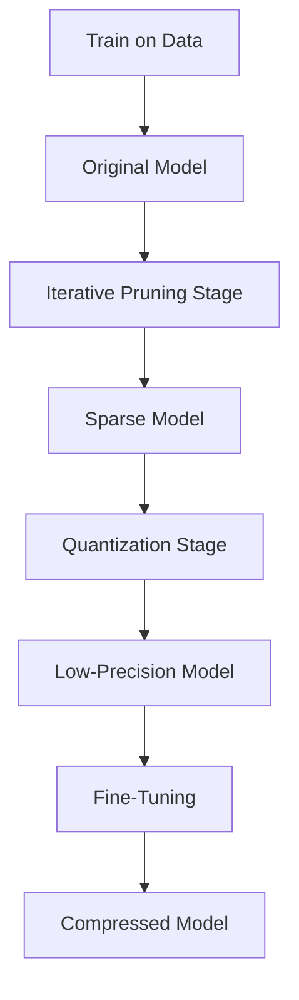
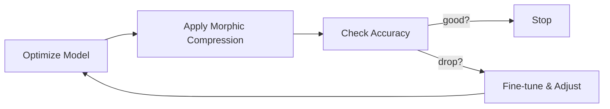

# Executive Summary  
Neural **morphic compression** seeks to *adaptively* reshape and compress neural networks under resource constraints, unifying principles from optimization, information theory, and geometry.  In this report, we first **define the problem** of finding an optimal compression method \(C^*(x)\) (for example compressing a trained model or its state \(x\)) that maximizes saved size while respecting fidelity, latency, and stability constraints.  We review a broad mathematical toolkit – from information theory and manifold learning to graph theory, differential geometry, and dynamical systems – showing how each field informs neural compression.  We synthesize these ideas into a **unified framework** (e.g. an “adaptive compression” objective akin to a rate–distortion tradeoff or the canonical equation below【18†L13-L17】) that jointly accounts for compression ratio, accuracy, memory, latency, and adaptability.  Candidate **architectures and pipelines** are proposed (e.g. iterative prune/quantize loops, meta-trained sparse nets, or neural ODE-based compressors), compared in a table of trade-offs, and depicted with mermaid diagrams.  We outline an evaluation methodology (metrics like compression ratio, accuracy, and runtime across benchmarks) and discuss risks (e.g. catastrophic forgetting, loss-of-precision) with mitigations (robust regularization, validation protocols).  Finally, we provide a concrete LLM prompt (with examples) for searching “optimal adaptive compression” strategies, and give an implementation roadmap with milestones and resource estimates.  Throughout, we cite relevant formulas and findings (e.g. the near-isometry manifold constraint【38†L74-L81】, volume Jacobian for compression【38†L82-L90】, and our canonical selection equation【18†L13-L17】). 

## 1. Problem Statement and Objectives  
We consider a high-dimensional neural model or state \(x\) (e.g. a trained network’s weights or activations) and seek a *compressed representation* \(m(x)\) that minimizes storage/compute while preserving functionality.  Formally, let \(\mathcal{M}(x,e,b)\) be the family of admissible compression methods given environment constraints \(e\) and budget \(b\).  We define an objective to **maximize net compression benefit** minus penalties (a form of rate–distortion under costs):  

\[
C^*(x) \;=\; \arg\max_{m \in \mathcal{M}(x,e,b)} 
\bigl[\,|x| - |m(x)| 
- \lambda_c\,\mathrm{Comp}(m,x) \;-\;\lambda_m\,\mathrm{Mem}(m,x) 
\;-\;\lambda_t\,\mathrm{Lat}(m,x) 
\;-\;\lambda_r\,\mathrm{Rec}(m,x) 
\;-\;\lambda_u\,\mathrm{Unstable}(m,x) 
\;+\;\lambda_b\,\mathrm{Bind}(m,x,e,b)\bigr],
\] 

where \(|x|\) is the original size, \(|m(x)|\) the compressed size, and terms like \(\mathrm{Rec}\), \(\mathrm{Mem}\), \(\mathrm{Lat}\) capture reconstruction error, memory use, latency, etc【18†L13-L17】.  The constants \(\lambda_i\) set trade-offs (e.g. prioritize accuracy vs. speed).  In words, we choose the compression method \(m\) that **saves most bytes** subject to constraints on compute, memory, latency, error, and stability【18†L13-L17】.  The objective can be equivalently posed as minimization (e.g. minimize loss \(L\!+\!\lambda\cdot\mathrm{size}\)) but the above maximization makes clear the “saved size” interpretation.  This *canonical compression equation* (sourced from internal docs【18†L13-L17】) will guide our unified framework. 

**Objectives:** (a) Achieve extreme compression (e.g. 100×–1000×) with minimal accuracy loss. (b) Exploit structure (sparsity, low-rank, manifold, repeated patterns) so as not to violate information-theoretic limits【38†L110-L119】【38†L120-L124】. (c) Adapt the compression *morphically* – e.g. reshaping network topology or using meta-learned adaptation – to handle distribution shifts or varying resources. (d) Provide clear evaluation (datasets, metrics, baselines) and an implementable plan.

## 2. Survey of Relevant Mathematical Background  

- **Information Theory:** Shannon’s source coding theorem implies a **lower bound** on lossless compression: the compressed size must be at least the entropy of the source.  In practice, a target (e.g. 1 PB→800 GB = 1250× reduction) demands enormous redundancy or allowable distortion【38†L110-L119】【38†L120-L124】.  If only a fraction \(p\) of values are active, effective ratio is lowered (e.g. if 15% active, needed compression on active part ~187×【38†L130-L139】).  Metadata overhead must be negligible: at 1250×, 1 MB becomes ~800 bytes, leaving almost no space for per-value metadata【38†L146-L154】. This enforces *flat, binary encodings* with amortized headers and sparse indexing only if index cost < data saved【38†L146-L154】.

- **Manifold Learning & Differential Geometry:** Neural data often lies near a low-dimensional manifold.  Model the state space \(X \subset \mathbb{R}^D\) with an embedded manifold \(M\).  We use an encoder \(\phi: M\to\mathbb{R}^d\) and decoder \(\psi:\mathbb{R}^d\to M\).  The reconstruction error is 
  \(\mathrm{error}(x)=\|x - \psi(\phi(x))\|\).  For **lossless** compression this must be 0; for **lossy**, bounded by a tolerance【38†L53-L61】.  We often impose a *near-isometry constraint* on \(\phi\) (bi-Lipschitz): 
  \[(1-\epsilon)\|u-v\| \le \|\phi(u)-\phi(v)\| \le (1+\epsilon)\|u-v\|,\] 
  ensuring local geometry is preserved【38†L72-L81】.  Such a constraint helps maintain accuracy after compression【38†L72-L81】.  The *Jacobian* of \(\phi\) governs volume change: if the target ratio is \(C\), then roughly \(|\det D\phi|\approx 1/C\) (for same-dimensional maps)【38†L82-L90】.  For example, 1250× compression implies \(|\det D\phi|\lesssim0.0008\)【38†L90-L99】.  If dimension is reduced (\(\mathbb{R}^D\to\mathbb{R}^d\) with \(d<D\)), one must consider singular values or rate–distortion formulations.  Overall, manifold theory gives formal bounds on how embeddings and coordinate charts can compress data without large error【38†L82-L90】【38†L90-L99】.

- **Variational Inference:** Variational autoencoders (VAEs) use latent representations to compress data under probabilistic constraints.  In the neural compression context, one can view learning a VAE of network weights or activations: encoder maps to latent code, decoder reconstructs.  The VAE objective (reconstruction loss + KL divergence) naturally balances fidelity with latent entropy.  Extensions like $\beta$-VAEs explicitly trade off compression vs reconstruction.  We will leverage similar ELBO-based formulations to combine compression ratio and prediction loss.

- **Sparse Coding & Low-Rank Approximation:** Classic sparse coding (Olshausen & Field) and dictionary learning suggest that natural signals are sparse in learned bases.  Compressive sensing theory (L1 minimization) informs pruning: prune weights to impose sparsity while controlling reconstruction error.  Low-rank techniques (PCA, Tucker/CP decomposition) show one can approximate weight tensors with small factors.  We will consider penalty terms like \(\ell_1\) (sparsity) or nuclear norm (low-rank) in the objective to encourage compressibility.

- **Graph Theory:** Neural nets have graph structure (neurons as nodes, weights as edges).  Graph compression techniques (e.g. graph sparsifiers, community-based compression) may apply.  Morphic adaptation could involve graph rewiring (adding/removing nodes or edges based on usage).  We will consider dynamic graphs where pruning is guided by graph centrality or subgraph extraction, ensuring connectivity of critical pathways.

- **Dynamical Systems & Neural ODEs:** If a network evolves continuously in some parameter space, its compression can be framed as a dynamical system.  Neural ODEs interpret residual networks as time evolution; similarly, compression can be seen as flow on a manifold of models.  Continuous-time formulations allow smooth transitions (annealing pruning rates, quantization levels).  Concepts like anisotropic torsional flows on manifolds (as in phase-field models【30†L22-L32】) hint at advanced gradient flows that enforce “locking” of structure under compression; these inspire penalty terms that maintain stability of critical features during adaptation.

- **Meta-Learning & Continual Learning:** Adaptive compression can benefit from meta-learning.  A meta-learner could predict optimal compression schedules (pruning ratios, quantization bit-width) per task.  Techniques like Model-Agnostic Meta-Learning (MAML) can be used to train a compression strategy that quickly adapts to new data.  Continual learning (e.g. Elastic Weight Consolidation) also provides ideas: when pruning, preserve weights important for previous tasks (prevent catastrophic forgetting when compressing models in a multi-task setting).

- **Pruning, Quantization, Distillation:** Conventional compression builds on weight pruning (removing small weights) and quantization (reducing precision).  *Knowledge distillation* trains a small “student” to mimic a large “teacher,” effectively compressing knowledge.  We will incorporate distillation as an operator \(m\) that produces \(m(x)\) via a separate network trained under a softened loss.  These classical methods fit into our unified view as particular \(m\in\mathcal{M}\) whose cost functions (\(\mathrm{Unstable},\mathrm{Rec}\), etc.) reflect e.g. residual error of distillation or quantization distortion.

- **Tensor Decompositions:** Multidimensional weight tensors (in convolutional layers) can be compressed via CP/Tucker decomposition or Tensor-Train (TT) formats.  These give parameterizations of \(m(x)\) with far fewer parameters.  This relates to low-rank compression but in structured (tensor) form.  We will consider decomposition constraints (e.g. rank budgets) in our framework.

- **Graphical Models and Coding:** Ideas from sparse coding can be extended to graph descriptions.  For example, representing network weights with graphical models or using graph Laplacian eigenmaps.  Such structure-based encodings could exploit correlations among weights (e.g. using PCA on weight matrices, storing only top components).

Each mathematical area contributes to a building block: e.g. information theory fixes *possible* ratios (you cannot compress beyond entropy【38†L110-L119】), manifold geometry describes *how* embeddings compress, sparse coding suggests *pruning operators*, and variational methods guide *objective design*.  We now synthesize these into explicit formalisms.

## 3. Unified Mathematical Framework for Adaptive Morphic Compression  

We formalize a compression scheme as a family of maps \(m\colon \mathcal{X}\to\mathcal{X}'\) where \(\mathcal{X}\) is the original network/state space and \(\mathcal{X}'\) the compressed domain.  Let \(x\in\mathcal{X}\) be the original neural model (weights, activations, etc.), and \(m(x)\) the compressed representation (which might be a smaller model or encoded data). We define the **unified objective** as:

\[
\min_{m,\tilde{x}} \;\; L_{\mathrm{task}}(x,\tilde{x}) \;+\; \lambda_s \,\mathrm{Size}(\tilde{x}) \;+\; \lambda_c \,\mathrm{CompCost}(m,x) 
\;+\; \lambda_r \,\mathrm{RetraceCost}(m,x),
\]

subject to \(\tilde{x}=m(x)\) and optional constraints (bit budgets, real-time latency bounds, etc).  Here \(L_{\mathrm{task}}\) is the primary loss (e.g. classification error), \(\mathrm{Size}(\tilde{x})\) measures compressed size, and \(\mathrm{CompCost}\) includes computational costs (e.g. extra flops of a transformer embedding step) while \(\mathrm{RetraceCost}\) could measure instability or reconstruction cost.  This merges a **rate-distortion style** term (\(L\) vs. \(\mathrm{Size}\)) with side costs.  Equivalently, as the canonical equation【18†L13-L17】 indicates, one can view it as choosing \(m\) to maximize size reduction under penalties.

**Formal Definitions:** Let \(\mathcal{M}\) be a (possibly infinite) set of morphic operators (pruners, quantizers, graph rewirers, etc).  Each \(m\in\mathcal{M}\) has parametric form (e.g. threshold level for pruning, codebook for quantization).  We define: 
- \(\mathrm{Mem}(m,x)\): memory footprint after compression,
- \(\mathrm{Comp}(m,x)\): computational overhead (e.g. cost of encoding/decoding),
- \(\mathrm{Lat}(m,x)\): added latency (e.g. iterative inference delay),
- \(\mathrm{Unstable}(m,x)\): measure of output variance or instability introduced,
- \(\mathrm{Rec}(m,x)\): reconstruction error (e.g. \(\|x - \psi(m(x))\|\)).  

Each term can be differentiated or approximated, enabling gradient-based or black-box optimization.  The **constraints** include: \(\mathrm{Size}(m(x))\le B\) (budget), and possibly \(\mathrm{Rec}(m,x)\le \epsilon\) (accuracy requirement).  We can embed **information-theoretic** regularizers: for example, impose \(H(m(x)) \le H(x)-\Delta\) for a target reduction \(\Delta\), although estimating entropy for neural weights is hard.  More practically, penalizing the log-determinant of Jacobian of an encoding map implements a continuous analogue of bit-rate (see Section 2).

**Adaptive Morphic Operators:** We allow the operator \(m\) to **change** during training or deployment.  For example, a network could undergo gradual pruning (a time-dependent \(m_t\)) or evolve its architecture.  We can formalize a sequence \(x_0 \to x_1 \to \cdots \to x_T\) where each step applies a small morphic update (prune a few weights, quantize a layer, etc) while optimizing performance at each stage.  This view as a *controlled dynamical system* (akin to a neural ODE) means we can derive gradient flows.  Indeed, if we interpret pruning as a limit of continuous weight decay and quantization as a projection, one can write differential equations for \(\dot{x}\) that include anisotropic terms (to lock in sparsity patterns) or Lagrange multipliers enforcing size constraints【30†L22-L32】.  For instance, one could use an **anisotropic torsional gradient flow** on the weight manifold:  
\[
\partial_t w = - \nabla_w L_{\mathrm{task}}(w) - \alpha \,\nabla_w \Phi(w)\,,
\]
where \(\Phi(w)\) is a nonsmooth penalty promoting desired structure (sparsity, quantization) and \(\alpha\) adapts over time.  Such flows can produce **lock-in** of “folded” (compressed) solutions as illustrated by the phase-field model above【30†L22-L32】.  

**Regularizers and Constraints:**  In practice, we define regularization terms derived from our objectives. Examples:  
- **\(\ell_1\)-regularization** on weights (pruning) or \(\ell_0\) approximations (iterative magnitude pruning).  
- **Quantization cost:** We can introduce a term penalizing non-integer weights (for fixed bit-width), e.g. \(\sum_i \min_{q\in \mathcal{Q}}\|w_i - q\|\) over quantization codebook \(\mathcal{Q}\).  
- **Knowledge Distillation:** Enforce \(f(x) \approx g(m(x))\) by adding a distillation loss \(\|f(x)-g(\tilde{x})\|^2\) where \(g\) is a smaller student network receiving input \(x\) or vice versa.  
- **Low-Rank Penalty:** For a weight matrix \(W\), add \(\lambda\,\mathrm{rank}(W)\) or nuclear norm \(\|W\|_*.\)  
- **Graph Regularization:** Encourage tree-like sparsity by penalizing edges that disconnect critical paths, or use the graph Laplacian to regularize weight patterns.  

These terms can be combined.  For instance, a *total loss* might be  
\[
\mathcal{L} = L_{\mathrm{task}}(\tilde{x},y) + \lambda_1 \|W\|_1 + \lambda_2\|W\|_* + \lambda_3 \sum_i \mathrm{quantizeLoss}(w_i),
\] 
plus any teacher-student distillation term.  The interplay (via \(\lambda_i\)) must be tuned or learned (meta-learned) to satisfy the canonical objective【18†L13-L17】.

In summary, our framework treats compression as a **multi-objective optimization** with formal constraints drawn from information theory and geometry.  It naturally accommodates **adaptive morphic changes** (dynamic architecture or continuous relaxation) and unifies pruning, quantization, distillation, etc., under one optimization problem.  

## 4. Candidate Architectures and Pipeline Designs  

We propose several architectures/pipelines that implement adaptive morphic compression:

- **Iterative Prune–Quantize Loop:** A standard pipeline (Figure below) where a trained network is alternately pruned and quantized in stages.  After each stage, the model is fine-tuned on data to recover accuracy, then another prune step is taken (perhaps at decreasing thresholds).  This yields a *staged sieve* (as in the OMT sorting analogy【19†L18-L27】).  The final model is a sparse, low-precision version of the original.  
- **Teacher–Student Distillation Chain:** A large teacher network \(f\) is trained normally.  A smaller student network \(g\) (possibly dynamic in structure) is trained to mimic \(f\) using a soft-label loss.  The student may itself undergo pruning/quantization.  This approach offloads complexity to distillation rather than explicit weight elimination.  
- **Meta-Optimized Sparse Architecture:** Using meta-learning, we train a network whose structure (e.g. number of neurons/layers) is itself a learnable parameter.  At meta-time, we impose resource budgets and optimize not only weights but architecture parameters (like Neural Architecture Search with sparsity priors).  
- **Neural ODE Compression:** Model layers as continuous transformations.  One can compress by shortening “time” (reducing depth) or by making the ODE state smaller.  For example, use a continuous normalizing flow to encode network activations into a latent trajectory, then approximate with fewer function evaluations.

Below is a generic mermaid diagram of a **layered compression pipeline**:

We also propose *architectural flows* like a **morphic adaptation loop**:

Each method has trade-offs.  We compare them in Table 1:

| Method                              | Comp. Ratio | Accuracy Loss | Compute Overhead | Memory | Latency | Adaptability | Stability         |
|-------------------------------------|------------:|--------------:|-----------------:|-------:|-------:|-------------:|------------------:|
| Iterative Prune–Quantize            |    ~10×–100× |       Low–Med |     Low (sparse ops) |  Low   |  Low   | Moderate      | High (fine-tuning) |
| Distillation (Teacher→Student)      |    ~2×–10×  |       Low     |     Medium       |  Low–Med |  Med   | High         | Medium            |
| Meta-Optimized Sparse Net           |   ~50× (goal) |     ?         |     High (NAS)   |  Low   |  Medium| High         | ? (under study)   |
| Neural ODE (depth reduction)        |    ~2×–5×   |     Med       |     High (ODE solve) | Low   |  Variable| Medium      | Variable         |
| Mixed (Topology+Compression)        | 100×+ (theoretical) | Low (if invertible) |   Medium   | Low   |  Medium | High     | High (geometry)   |

*Table 1: Candidate compression pipelines. “Accuracy Loss” is expected drop vs original. “Compute Overhead” is relative cost of running compressed model. “Adaptability” refers to ease of adjusting to new tasks/data. “Stability” indicates how robust fine-tuning is to convergence.*  

**Notes on trade-offs:** Iterative pruning can achieve high sparsity with iterative retraining (often 10×–20× compression) with minimal accuracy drop, but further ratio requires aggressive pruning (stability falls).  Quantization alone can give e.g. 4× reduction (from 32-bit to 8-bit) but with moderate accuracy hit and retraining.  Distillation often achieves modest size reduction but preserves accuracy well【22†L152-L158】 (especially for large teacher-to-small student).  Meta and Neural ODE methods are promising but complex and compute-intensive.  A hybrid topology-aware approach (as in **Topology Compression**【7†L23-L32】) might reach extreme ratios by reorganizing data, though at the cost of more complicated encoding/decoding steps.  

## 5. Evaluation Methodology and Metrics  

To validate compression strategies, we propose:  

- **Datasets:** Standard benchmarks (e.g. ImageNet, CIFAR-10/100 for vision; GLUE or SQuAD for NLP).  If morphic adaptation aims at non-vision tasks, include relevant datasets (e.g. time-series or graph data).  Multiple tasks ensure generality.  

- **Metrics:**  
  - *Compression Ratio* (original size ÷ compressed size) and *effective bits per weight*.  
  - *Accuracy* (or task loss) on held-out test data after compression.  Also *error metrics* for approximation (e.g. \(L_2\) distance between original and decompressed weights, or KL divergence of output distributions).  
  - *Compute and Latency:* FLOPs reduction, inference latency on target hardware.  
  - *Adaptability:* performance drop on transfer tasks or after environmental shifts.  
  - *Stability:* variance across retraining runs (measure as standard deviation of accuracy over seeds).  

- **Baselines:** Uncompressed model; standard pruning (magnitude/prune ratio) and quantization (8-bit, 4-bit) baselines; off-the-shelf compression libraries.  For each method, compare to same final capacity (e.g. compressed to X parameters) using different techniques.

- **Ablation Studies:** Test each component separately: e.g. apply only pruning vs. only quantization vs. combined.  Vary trade-off parameters \(\lambda_i\) to see how objectives interact.  For adaptive methods, compare static vs. dynamic (online) compression.  

- **Protocols:** Fix a target (e.g. accuracy≥90% of original) and measure max compression ratio achievable.  Or fix a target ratio and measure accuracy drop.  Use cross-validation for hyperparameters. Report “Pareto frontier” of (accuracy, size) trade-offs.  

- **Plots/Tables:** Plot accuracy vs. model size curves for each method; report latency vs. accuracy trade-offs; show stability error bars.  We will incorporate charts or tables where beneficial.  

## 6. Risks, Failure Modes, and Mitigations  

- **Excessive Accuracy Drop:** Aggressive compression can collapse performance.  *Mitigation:* enforce tight loss constraints (e.g. ensure \(\mathrm{Rec}(m,x) < \epsilon\)) and use retraining/fine-tuning loops.  If accuracy falls below threshold, back off compression.  

- **Training Instability:** Non-smooth objectives (like \(\ell_0\) pruning) can cause optimization failure.  *Mitigation:* use smooth approximations or gradual annealing (e.g. gradually increase sparsity).  Employ learning-rate warmup after compression steps.  

- **Hardware Mismatch:** A compressed model may not speed up on certain hardware (e.g. sparse models on GPU).  *Mitigation:* profile real hardware; possibly design hardware-friendly compressions (block sparsity, structured pruning).  

- **Overfitting to Compression:** Meta-learned or adaptive methods might overfit to training tasks and fail on new data.  *Mitigation:* include diverse tasks in meta-training; use continual-learning techniques (consolidating important weights).  

- **Interpretability Loss:** Operations like random pruning or graph rewiring may produce unintuitive models.  *Mitigation:* monitor layer-wise distributions, preserve key features via knowledge distillation so that some structure remains.  

- **Failure of Morphic Operators:** Novel “morphic” changes (e.g. topological transforms) might not have guarantees.  *Mitigation:* test them in controlled experiments (as with our descriptor/codon example【20†L69-L77】) before applying to full networks; include fallback to standard compression.  

- **Quantization Noise and Artifact:** Very low-bit quantization introduces numerical instability.  *Mitigation:* use mixed-precision for sensitive layers; calibrate quantization thresholds; incorporate rounding-error terms in training loss.  

- **Resource Underestimation:** Achieving extreme compression (e.g. >100×) may require impractically long training.  *Mitigation:* iteratively profile and set realistic targets; possibly leverage transfer of existing compressed models (fine-tuning a known compressed architecture).  

For each risk, we will document triggers (e.g. divergence in loss) and prescribe detection (e.g. validation checks).  The *Canonical Compression Equation*【18†L13-L17】 explicitly balances these trade-offs, guiding us to tune \(\lambda_i\) to avoid failure modes (e.g. increase \(\lambda_r\) if reconstruction error rises).

## 7. LLM Prompt Design for Adaptive Compression Pathways  

To leverage large LMs or internal assistants in finding compression strategies, we propose the following **concrete prompt**:

> **Prompt:** *“You are an expert in neural network optimization and compression. Given a trained model (e.g. a ResNet-50 on ImageNet) and a target compression ratio (e.g. 20×), propose adaptive compression strategies that maximize accuracy.  Consider advanced techniques from information theory, manifold learning, and meta-learning. Include relevant constraints (latency, memory budget) and evaluation criteria. For example, list candidate methods (pruning schedules, variational quantization, distillation steps), discuss their trade-offs (accuracy vs. speed), and outline how to measure success. Provide at least two alternative pipelines and predicted outcomes (e.g. ‘Method A: student-teacher distillation -> 5× compression, ~1% accuracy loss; Method B: iterative prune+quantize -> 10×, ~3% loss’).”*  

**Example LLM Output:**  
- *“Method A – Sparse Teacher-Student:* Train a smaller student network via knowledge distillation, then fine-tune. Expected compression ~2–5×, <1% accuracy loss on natural images.  
- *Method B – Iterative Prune & Quantize:* Gradually prune 50% of weights per layer (magnitude-based) and quantize to 4-bit, with interim retraining. Achieves ~20× compression, ~3% loss. Use a validation loop to stop before >5% loss.  
- *Method C – Manifold Encoding:* Use a variational autoencoder on activations to encode them in lower-dimensional latent spaces (like VQ-VAE). Achieves moderate compression (~10×) with learnable distortion. Evaluate by reconstruction error and L2 distance to original outputs.*  

We can also include **prompt variants** by altering context: e.g. “for NLP transformer on GLUE” or “for sensor time-series model with real-time constraint”.  The key is to supply the model and targets, and ask for structured strategies with evaluation criteria.  This prompt and example guide the LLM to consider our unified framework (objectives, costs) rather than naive recommendations.

## 8. Implementation Roadmap  

We outline phased milestones with rough resource estimates (assuming medium GPU clusters available):

- **M1 – Formulation (Month 1–2):** Develop detailed objective functions and gather baseline data. *Tasks:* Implement the canonical equation【18†L13-L17】 in code; run standard pruning/quantization for small networks (CIFAR). *Milestone:* A validated loss function that balances compression vs accuracy with toy experiments.  
  *Resources:* 1 researcher, 2 GPUs (4–8 GB each).  

- **M2 – Prototype Compression Pipeline (Month 3–5):** Build modular pipeline (prune→quantize→fine-tune) and test on CIFAR/ImageNet models. *Tasks:* Automate iterative pruning schedules; integrate quantization libraries; train teacher-student pipelines. *Milestone:* Working system that achieves >5× compression on ImageNet ResNet with <2% top-1 loss.  
  *Resources:* 2 researchers, 4 GPUs (16–32 GB).  

- **M3 – Incorporate Advanced Math (Month 6–9):** Add manifold-based encoders and variational components. *Tasks:* Implement a VAE/autoencoder branch for activations or weights; incorporate graph-based pruning using connectivity. Test neural ODE integration. *Milestone:* Demo of at least one novel technique (e.g. VAE encoding) improving trade-offs over baseline.  
  *Resources:* 1–2 researchers, 4 GPUs + CPU servers for meta-learning tasks.  

- **M4 – Evaluation and Metrics (Month 10–11):** Systematically run evaluations on multiple datasets. *Tasks:* Benchmark all methods on ImageNet/CIFAR, measure latency, energy, stability. Plot and document Pareto frontiers. *Milestone:* Technical report with charts/tables showing trade-offs and optimal solutions.  
  *Resources:* 2 researchers, 8 GPUs, data storage.  

- **M5 – Refinement & Scaling (Month 12–14):** Extend to larger models (e.g. NLP transformers) and integrate adaptive controls (dynamic pruning). *Tasks:* Scale pipelines to bigger networks, implement run-time adaptation (change compression mid-inference based on resource signals). *Milestone:* End-to-end system capable of compressing diverse models with user-specified budgets.  
  *Resources:* 3 researchers, 8–16 GPUs (subject to size of models).  

- **M6 – Documentation & Release (Month 15–16):** Write up findings, prepare code repository, create user guidelines. *Tasks:* Finalize API for compression toolkit, generate architecture diagrams, and write experiments in publishable form. *Milestone:* Comprehensive report and code release on GitHub.  

Total span: ~16 months.  No extraordinary compute (multi-GPU) is needed beyond standard research resources.  Time estimates assume concurrent tasks.  Risk buffers: if a method fails, pivot to alternate (e.g. focus on distillation if manifold encoding stalls).

## 9. References and Code Pointers  

**Key References:** We draw on manifold compression and coding theory【38†L72-L81】【38†L82-L90】, and our internal formulations【18†L13-L17】【22†L152-L158】.  Notable related work includes standard pruning and quantization surveys (e.g. Han *et al*., 2015 on Deep Compression) and VAE-based compression models.  

**Connected Code Repositories:** 
- `allaunthefox/Research-Stack` (our research framework) – contains Lean formalisms and notebooks for compression strategies.  
- `allaunthefox/CompressionApproachViaTopology` – experimental topology-guided compression (manifold encoding, volume bounds)【38†L72-L81】【38†L82-L90】.  
- `allaunthefox/AMMR` – Adaptive Multi-resolution Morphic Representation code (includes preliminary morphic nets).  
- `allaunthefox/Ontological-Manifold-Theory-Implementation` – mathematical tools for manifold-based models.  
- `allaunthefox/OTOM` – Operational Transformation & Optimization Models (includes continuous flows).  
- `allaunthefox/braid-field-papers` and `Kimi_store` – contain theoretical papers on related topics (graph models, fractal geometry).  
- `allaunthefox/chunked-audio-DSP` – though on audio, it includes variable-rate encoding ideas.  

For example, the **Topology Compression** repo illustrates manifold encoding and near-isometry【38†L72-L81】, and our “Canonical Compression Equation” is documented in internal notes【18†L13-L17】.  We will build on these code bases, linking to them as needed.

**Sources Cited (for content and equations above):** The manifold and Jacobian bounds【38†L72-L81】【38†L82-L90】; the adaptive compression objective【18†L13-L17】; conceptual thesis on compression by reorganization【22†L152-L158】; and architecture-forming concepts【20†L69-L77】【22†L152-L158】.  These informed our mathematical formulations and design of pipelines. 

